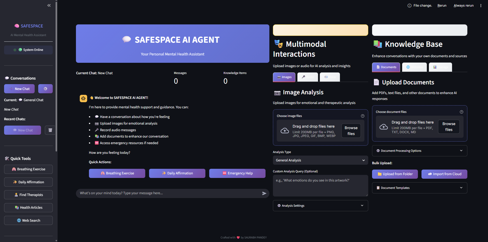
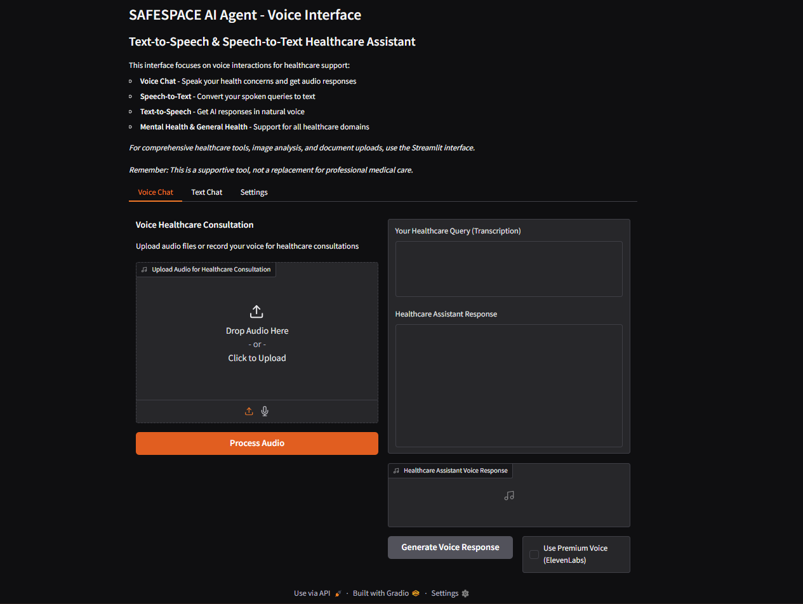

# 🌟 SAFESPACE AI AGENT - Multimodal Health Assistant

## 📋 Overview

SAFESPACE AI AGENT is a comprehensive multimodal health assistant built with proper **MVC (Model-View-Controller) architecture**. The system provides empathetic mental health support through **text**, **images**, and **voice** interactions, with **OpenAI as the primary AI provider** and GROQ as fallback.

The system features two modern web interfaces:
- **Gradio Interface**: Advanced multimodal web interface with real-time processing
- **Enhanced Streamlit Interface**: Professional UI with comprehensive features and file management

## 🏗️ **MVC Architecture**

### **Model Layer** (`models/`)
- **`api_models.py`**: Pydantic models for API requests/responses
- **`business_models.py`**: Business logic models, data structures, and session management

### **View Layer** (`views/` & `frontend/`)
- **`gradio_ui.py`**: Modern Gradio-based multimodal web interface
- **`streamlit_app.py`**: Enhanced Streamlit interface with advanced features
- **`app.py`**: Original Streamlit interface (maintained for compatibility)

### **Controller Layer** (`controllers/`)
- **`mental_health_controller.py`**: Core business logic controller orchestrating all interactions

### **Core Services** (`core/`)
- **`agent.py`**: LangGraph-based AI agent (using OpenAI GPT-4o)
- **`tools.py`**: AI tools for various mental health functions
- **`audio_processor.py`**: Comprehensive audio processing service
- **`rag_manager.py`**: Document retrieval and knowledge management

### **Backend API** (`backend/`)
- **`api.py`**: FastAPI REST endpoints following MVC patterns
- **`main.py`**: FastAPI server configuration
- **`config.py`**: Centralized configuration management

## 🚀 **Key Features**

### **🎯 AI Service Priority**
1. **Image Analysis**: OpenAI GPT-4 Vision → GROQ Llama Vision
2. **Speech Transcription**: OpenAI Whisper → GROQ Whisper → Google Speech Recognition
3. **Text Generation**: OpenAI GPT-4o (primary)
4. **Voice Synthesis**: ElevenLabs → Google TTS

### **📱 Multimodal Capabilities**
- **Text Conversations**: Full therapeutic chat with emergency detection
- **Image Analysis**: Art therapy, emotional assessment, visual therapeutic insights  
- **Voice Interactions**: Speech-to-text, voice responses, hands-free conversations
- **Emergency Protocols**: Multi-modal crisis detection and intervention

### **🔒 Robust Architecture**
- **Separation of Concerns**: Clear MVC boundaries
- **Error Handling**: Comprehensive fallback systems
- **Session Management**: Multi-user session support
- **API Documentation**: Interactive OpenAPI docs
- **Type Safety**: Full Pydantic validation

## 📸 Screenshots

### Main Dashboard

### Voice Interface

## 📁 **Project Structure**

@@ -380,3 +379,4 @@
*Remember: This system is designed to complement, not replace, professional mental health care.*
